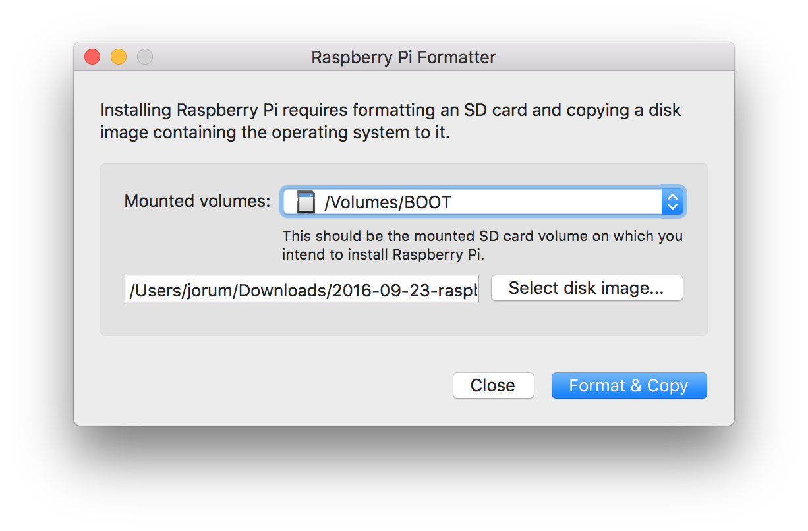

# Raspberry Pi Formatter

> macOS tool for creating a properly formatted SD card with a Raspberry Pi operating system disk image.

## Install

Download from [here](https://github.com/jlowgren/RPiFormatter/releases/download/v0.1/RPiFormatter.zip).

## Usage

1. Select an SD card volume.
2. Select the disk image to copy.
3. Click "Format & Copy".
4. Wait until you're presented with a confirmation.
5. Eject the SD card and insert it into your Raspberry Pi.

## License

MIT
